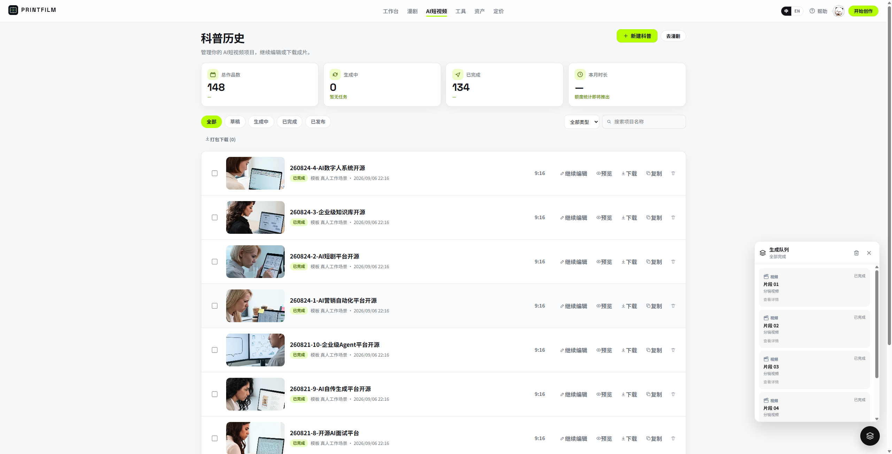
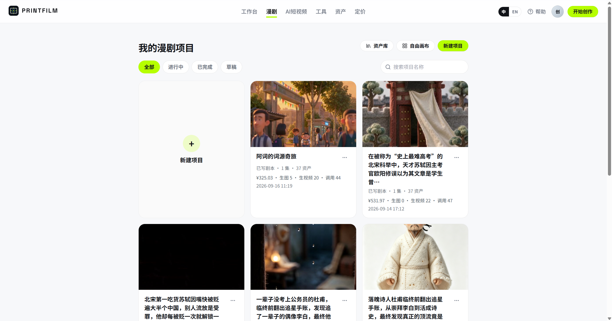
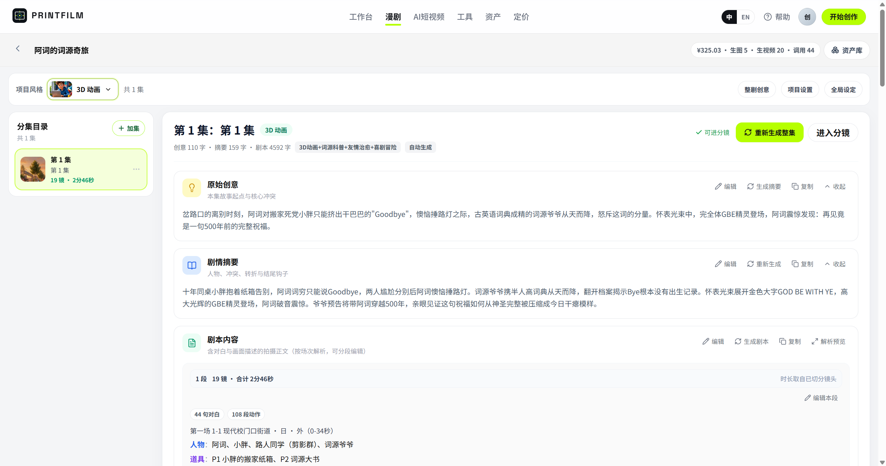
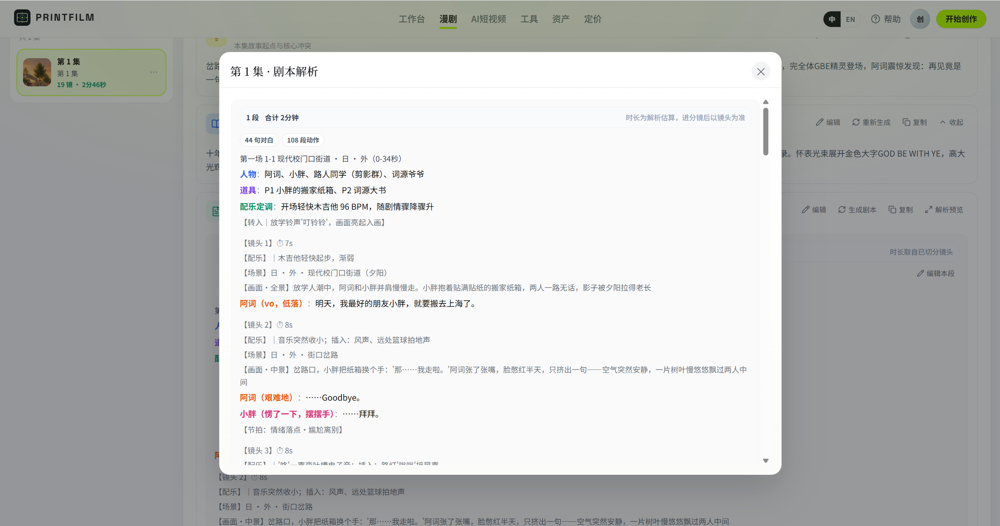
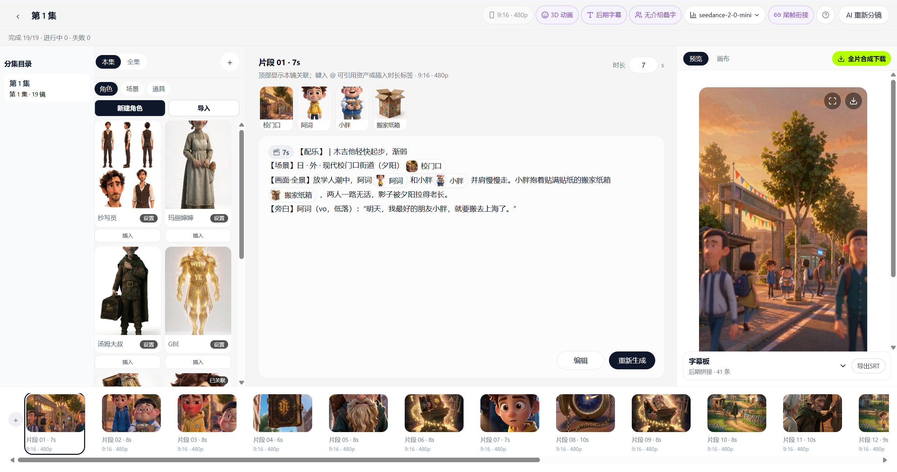
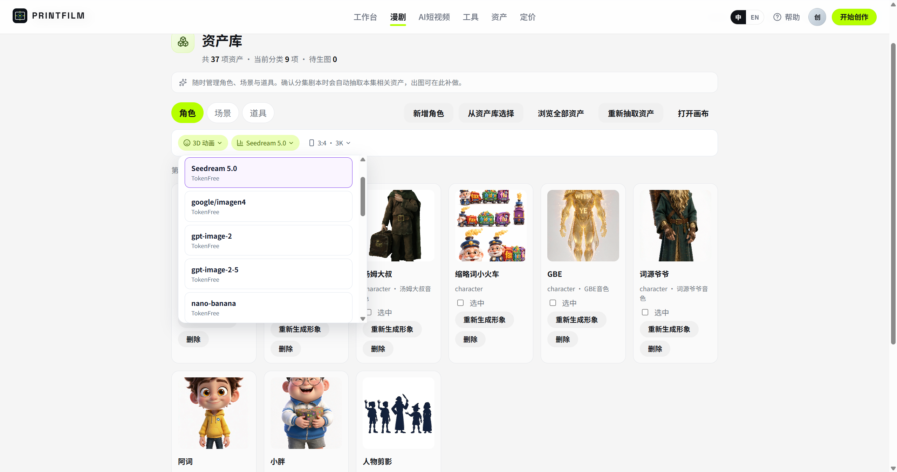

# Novafilm

[](LICENSE)
[](https://github.com/yi1108/printfilm)

> **Đưa câu chuyện thành một đoạn phim có thể phát** — nền tảng sáng tạo AI drama
> ngắn và AI short video, từ kịch bản đến bản dựng hoàn chỉnh.

Nhập chủ đề hoặc kịch bản → chia cảnh (分镜) → sinh ảnh → sinh video → dựng thành
phim bằng FFmpeg. Lời dẫn được sinh kèm khi dựng video, không cần thu âm riêng.

---

## ⚠️ Read this first: this is a derivative work

This repository is **not** the official release of PRINTFILM. It is a private fork
built on top of it.

| | |
|---|---|
| Upstream | [github.com/yi1108/printfilm](https://github.com/yi1108/printfilm) — Copyright (c) 2026 PRINTFILM, MIT |
| This fork | Renamed product, new visual design system, third UI locale (`vi`), rewritten operations documentation |
| Licence | MIT, inherited. `LICENSE` is kept byte-identical to upstream and must stay that way |
| Attribution | [`NOTICE`](NOTICE) at the repo root |
| Trademark | The PRINTFILM name and logo remain the upstream authors' property. MIT does not grant trademark rights. We have rebranded; the wordmark is being retired item by item — see [`docs/OPEN_SOURCE_CHECKLIST.md`](docs/OPEN_SOURCE_CHECKLIST.md) §2 |

**Before you redistribute this code**, read
[`docs/OPEN_SOURCE_CHECKLIST.md`](docs/OPEN_SOURCE_CHECKLIST.md). Two items are
currently `NO-GO` for public or commercial distribution: residual PRINTFILM marks in
user-facing surfaces and legal text (§2.1, §2.2, §2.3), and the provenance of the
bundled image-style previews (§3.1, §3.6).

---

## Screenshots

> These were captured from the upstream PRINTFILM build and still show its branding
> and Chinese-only UI. They are kept for reference while the rebrand lands
> ([`docs/OPEN_SOURCE_CHECKLIST.md`](docs/OPEN_SOURCE_CHECKLIST.md) §2.1) and should
> be recaptured before any public release. Vietnamese and English screenshots do not
> exist yet.

**User app — history, storyboard, film preview**

| Project history | Storyboard workbench | Film preview |
|:---:|:---:|:---:|
|  |  |  |

**AI drama — projects, episodes, script, storyboard, assets, admin**

| Project list | Episode workbench | Script parse |
|:---:|:---:|:---:|
|  |  |  |

| Storyboard editor | Asset library | Admin console |
|:---:|:---:|:---:|
|  |  |  |

---

## Project status

| Area | State |
|------|-------|
| User app, admin console, API, task platform, billing, payment | Working, self-hosted |
| Locales | `vi` (default), `en` (secondary), `zh` (retained) |
| Migrations | **None.** `create_all` at startup plus hand-written additive DDL. Single worker required |
| Task execution | In-process asyncio. No external worker. Celery is a vestigial dependency |
| Upstream AI provider | **Locked to a single provider** (see below) |
| Tests | `backend/tests/` — extensive, but no CI pipeline and no coverage measurement |
| Missing standard docs | `SECURITY.md`, `CONTRIBUTING.md`, `CODE_OF_CONDUCT.md`, `CHANGELOG.md` — see checklist §7 |

### Single-provider lock-in — the main operational risk

The open-source build is hard-locked to **one** upstream AI gateway, enforced in
`backend/app/services/tokenfree_gateway.py` and `backend/app/services/model_settings.py`.
There is no admin switch to change it. A fork that loses access to that provider
loses image and video generation entirely, with no fallback.

This is a deliberate distribution choice, documented rather than hidden. Making the
provider pluggable is a scoped 2–3 week engineering project, analysed in
[`docs/OPEN_SOURCE_CHECKLIST.md`](docs/OPEN_SOURCE_CHECKLIST.md) §5.

### No media URLs expire

Every asset is either a relative `/static/...` path or a public object-storage URL.
There are no signed URLs and no expiry. Anyone who can read an asset URL can read the
asset. This is a deliberate simplification; treat object storage bucket policy as the
real access control.

---

## What it does

### 1. AI drama (漫剧)

From a one-line idea to per-episode finished films, with reusable characters and
scenes.

- Outline, story summary, full script
- Asset library: characters, scenes, props
- Parse into shots, then storyboard editing and a node canvas
- Detail: [`docs/EPISODE_RULES.md`](docs/EPISODE_RULES.md)

### 2. AI short video

Pick a template, follow the shot pipeline. Suited to lead-gen and explainer content.

- 20+ built-in style templates
- `full` (image + video + compose) or `image_text` (stills, faster and cheaper)
- Per-shot image redraw and video regeneration; jobs keep running after you leave the page
- Final film assembled by FFmpeg

### 3. Tool centre

Single-purpose capabilities that skip the full pipeline: text-to-image,
image-to-image, text-to-product, text-to-video, video-to-video, e-commerce collage.

### 4. Admin console and open API

Users, orders, templates, task centre, model routing. Open endpoints under
`/api/v1` for image and video generation (Bearer token or `X-Api-Key`).

---

## Pipeline

```
input topic or script
    → shots
    → images
    → video (narration generated alongside)
    → FFmpeg compose
```

Any stage can be redone per shot. Progress is visible from the history page.

---

## Stack

| Layer | Choice |
|-------|--------|
| Backend | Python 3.12 · FastAPI · SQLAlchemy (asyncpg) · Pydantic v2 |
| Database | PostgreSQL 16 |
| Cache / pub-sub | Redis 7 |
| Frontend | React 19 · TypeScript 6 · Vite 8 |
| Admin | React 19 · Tailwind v4 · Radix (shadcn-style) |
| Media | FFmpeg / FFprobe on `PATH` |
| AI | One OpenAI-compatible upstream gateway, locked in configuration |

---

## Quick start (Docker, all-in-one)

Requires [Docker Desktop](https://www.docker.com/products/docker-desktop/) or
Docker Engine with Compose. The images are in a public registry namespace, so
`docker pull` needs no login.

### 1. Clone and prepare the environment

```bash
git clone <this-repo>
cd <this-repo>

cp deploy/.env.docker.example deploy/.env.docker
```

Edit `deploy/.env.docker`. At minimum, change these three:

| Variable | Why |
|----------|-----|
| `POSTGRES_PASSWORD` | Database password. Never the example default |
| `SECRET_KEY` | Long random string. Signs sessions **and** encrypts every secret stored in the database. Rotating it later silently invalidates all stored upstream keys |
| `ARK_API_KEY` / `OPENAI_API_KEY` | Your upstream API key. Fill the same value in both |

No key yet, just want to look around? Set `ARK_MOCK=true`.

### 2. Start

```bash
docker compose --env-file deploy/.env.docker up -d
```

Wait about 30 seconds — the web and admin containers wait for the API health check
to pass.

| Service | URL |
|---------|-----|
| User app | http://localhost:8080 |
| Admin console | http://localhost:8081 |
| API / OpenAPI docs | http://localhost:8000 · `/docs` |
| Health check | http://localhost:8000/api/health |

```bash
docker compose --env-file deploy/.env.docker ps          # status
docker compose --env-file deploy/.env.docker logs -f api # logs
docker compose --env-file deploy/.env.docker down        # stop, keep data volumes
```

### 3. First user, first admin

| Role | How |
|------|-----|
| Regular user | Open the user app → `/auth`, register with an e-mail address |
| Admin | Register with that address first → set `ADMIN_BOOTSTRAP_EMAILS=<address>` in `deploy/.env.docker` → `docker compose --env-file deploy/.env.docker up -d --force-recreate api` |

`ADMIN_BOOTSTRAP_EMAILS` only **promotes existing users**. It never creates accounts.
It is read at startup only, so the recreate is required.

There are no built-in demo accounts. Change every secret before going live.

### 4. Building from source

```bash
docker compose --env-file deploy/.env.docker -f docker-compose.full.yml up -d --build
```

### 5. Running without Docker

Postgres and Redis only:

```bash
cp deploy/.env.prod.example deploy/.env.prod
docker compose -f deploy/docker-compose.yml --env-file deploy/.env.prod up -d
```

Then the API and the two front-ends on the host:

```bash
cd backend
python -m venv .venv && ./.venv/bin/activate
pip install -r requirements.txt
cp .env.example .env          # then edit it
uvicorn app.main:app --host 0.0.0.0 --port 8000

cd ../frontend && npm install && npm run dev    # 5173
cd ../admin    && npm install && npm run dev    # 5174
```

Host requirements: Python 3.12, Node.js, FFmpeg on `PATH`, **and a CJK-capable
font** — subtitles are burned in with FFmpeg `drawtext` and render as tofu boxes
without one. See [`docs/OPERATIONS.md`](docs/OPERATIONS.md) §2.2.

---

## Locales

| Locale | Role | Font |
|--------|------|------|
| `vi` | Default | Noto Sans |
| `en` | Secondary | Space Grotesk / Figtree |
| `zh` | Retained | Noto Sans SC |

Users pick a language from the header; the choice persists in `localStorage`. First
visit follows `navigator.language`.

The `Messages` type is derived from the `zh` tree, so **every locale must carry every
`zh` key with the same shape**. A missing key is a `tsc` error, not a runtime
fallback.

**API enum values are never translated.** Statuses, pipeline modes, ledger kinds,
model ids and task types stay exactly as the server sends them; Chinese/Vietnamese
exists only in display-mapping tables. See
[`docs/STANDARDS.md`](docs/STANDARDS.md) §4.1.

The admin console has **no** i18n layer and renders in Chinese only. Plan:
[`docs/ADMIN_I18N_PLAN.md`](docs/ADMIN_I18N_PLAN.md).

---

## Configuration

`backend/.env`, resolved as: environment → `Settings` → DB overlay → effective
value. The DB overlay (editable in the admin console) wins; `.env` is only the
first-import seed. `backend/app/config.py` holds all 113 settings.

The four that will bite you:

| Setting | Trap |
|---------|------|
| `DATABASE_URL` | Must start with `postgresql` or the import raises. Read once at startup, so admin changes need a restart |
| `SECRET_KEY` | Signs JWTs and derives the DB secret-encryption key. Rotating it breaks every stored upstream key |
| `MODEL_IMAGE` / `MODEL_VIDEO` | The `config.py` defaults are Volcengine ARK endpoint ids, not catalogue ids, and the image default 404s. Use `seedream-5-0-pro` and `seedance-2-5` |
| `EPAY_NOTIFY_URL` | Must **not** contain `/api/`. The payment gateway's WAF blocks it. Use `/epay/notify` plus an nginx rewrite |

Full reference: [`docs/OPERATIONS.md`](docs/OPERATIONS.md) §3.

---

## Operations

[`docs/OPERATIONS.md`](docs/OPERATIONS.md) is the runbook. It was written from the
code, not from memory, and every claim carries a `path:line` citation.

| Topic | Section |
|-------|---------|
| Architecture and process model | §1 |
| Configuration resolution order | §3 |
| Task lifecycle, statuses, recovery, timeouts | §4 |
| Billing: pre-hold, usage, settlement, `billing_basis` | §5 |
| Model routing and failover order | §6 |
| Payment order and callback flow | §7 |
| Schema, media storage, Redis, FFmpeg | §8 |
| Deployment shapes and production checklist | §9 |
| Troubleshooting tables | §10 |
| Known traps | §11 |

### Task platform in one paragraph

There is no external worker. Scheduler, poller, executor and watchdog are asyncio
tasks started by the FastAPI lifespan (`backend/app/main.py:114`). **Run uvicorn with
`--workers 1`** — two workers means two schedulers racing over the same rows, and
progress SSE silently degrades to a per-process queue. Tasks waiting on upstream
video (`awaiting_poll`) do **not** occupy a concurrency slot. A full walkthrough is
in `docs/OPERATIONS.md` §4.

### Billing in one paragraph

Wallet unit is the fen. Every task runs: balance check → `freeze_for_task` →
`record_line` usage rows → `settle_task` (charge the real amount, release the rest).
Settlement is idempotent through three separate guards. A cancel that lands while
usage is still being written deliberately does **not** refund — see
`docs/OPERATIONS.md` §5.7 before you "fix" that.

---

## Repository layout

```
backend/                  FastAPI, pipelines, billing, in-process task platform
frontend/                 User app (Vite, custom CSS design system, i18n)
admin/                    Operations console (Vite, Tailwind, no i18n yet)
deploy/                   Middleware compose, env examples, maintenance scripts
docs/                     Standards, operations, open-source audit, i18n backlog
NOTICE                    Upstream attribution and rebrand summary
docker-compose.yml        Pull public images, one command
docker-compose.full.yml   Build from source
```

---

## Tests

```bash
cd backend
pip install -r requirements-dev.txt
pytest                              # full suite
pytest tests/test_kepu_continuity.py # one file
pytest tests/test_x.py::test_name    # one test
```

Tests that use the `db_session` fixture are integration tests and **need PostgreSQL
running**; they roll back per test and do not persist. The rest are pure unit tests.
`conftest.py` stubs upstream price-list network calls automatically.

There is **no CI pipeline**. Everything above runs locally only.

```bash
cd frontend && npm run lint && npm run build
cd admin    && npm run lint && npm run build
```

---

## Contributing

Issue and pull requests are welcome. Before you open one, read
[`docs/STANDARDS.md`](docs/STANDARDS.md) and work through its §9 checklist.

The short version:

- Conventional Commits, English message, explain **why**
- No hard-coded user-visible copy — go through `i18n`; never translate an API enum value
- Comments and docstrings in `vi` or `en`; never add new Chinese comments
- Server-side pagination and filtering; all three states (loading / empty / error)
- Never commit `.env`, keys, or generated media
- If you touch billing, routing, the task platform, or deployment, update
  `docs/OPERATIONS.md` in the same commit
- **Never modify `LICENSE`**

---

## Licensing

MIT. See [`LICENSE`](LICENSE) for the full text (kept unmodified from upstream) and
[`NOTICE`](NOTICE) for attribution and the rebrand summary.

Third-party dependencies are under their own licences. That audit is **not yet
complete** — see [`docs/OPEN_SOURCE_CHECKLIST.md`](docs/OPEN_SOURCE_CHECKLIST.md) §6.
